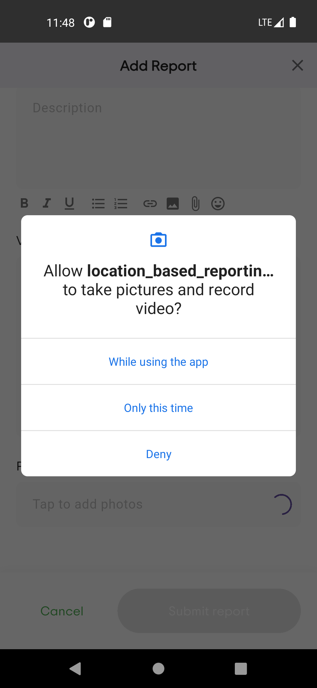

#  Location-Based Reporting App

This is a simplified location-based reporting mobile application built with Flutter. The app enables users to log in, submit incident reports with categorized descriptions, attach media (images or videos), and specify the report location using an address or interactive map.

## Features
- User Authentication 

- User Dashboard

- User Profile

- Report Submission

- Title & description

- Category selection

- Location input (map pin or typed address)

- Media attachment (camera or gallery)

- View Past Submissions

## Project Approach

- Built using Flutter with Clean Architecture principles.

- Geolocator and geocoding packages are used for address and coordinate translation.

- Modular UI components and best Flutter practices.

##  Tech Stack and Dev Packages

- Flutter

- Geolocator & Geocoding

- Permission Handler

- Flutter ScreenUtil

- Image Picker

- Path Provider

##  ScreenShots 

 |  |  |    |   |   |  |  |  | 

##  Setup Instructions

1. Clone the repository

git clone https://github.com/yourusername/location-reporting-app.git
cd location-reporting-app

2. Install dependencies

flutter pub get

3. Run the app

flutter run
